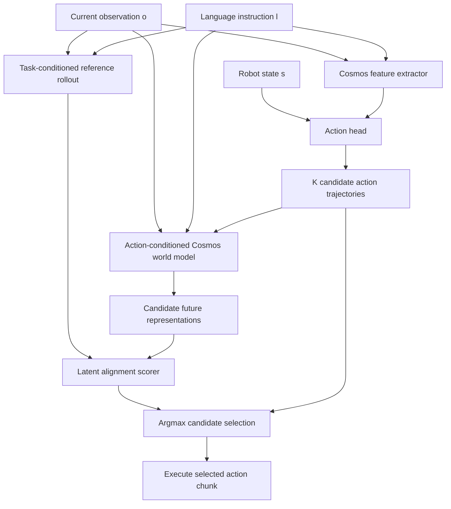

# DiT4DiT + FOREWARN: Stage 1

> Action-conditioned world-model planning for vision-language-action control

本仓库是 DiT4DiT 的研究分支：在基础视觉语言动作策略上加入 FOREWARN-style Stage 1 候选规划。策略先生成多条动作轨迹，动作条件 Cosmos-Predict2.5 再预测每条轨迹对应的未来表征，并通过与任务条件 reference future 的语义一致性选择最终动作。

当前仓库面向论文研究与可复现实验，README 同时记录方法定义、实现状态、代码对应关系和训练运行约束。这里描述的是已经进入代码的 Stage 1；RL selector、RL policy improvement 以及尚未完成的实验结论不属于当前实现。

## Contents

- [Research snapshot](#research-snapshot)
- [Method](#method)
- [Implementation map](#implementation-map) and [status](#implementation-status)
- [Installation](#installation), [data](#data), and [configuration](#configuration)
- [Training](#training) and [inference](#inference)
- [Evaluation and paper reporting protocol](#evaluation-and-paper-reporting-protocol)
- [Tests](#tests) and [branch development record](#branch-development-record)
- [Limitations](#limitations), [citation](#citation), and [license](#license-and-responsible-use)

## Research snapshot

本节用于固定论文代码的来源，避免后续工程修改与论文实验版本混淆。

| 项目 | 记录 |
| --- | --- |
| 研究分支 | `linjs` |
| 上游基线 | `upstream/main@66a6f3a` |
| 本 README 覆盖的实现 | `linjs@6895241` 及此前提交 |
| 记录日期 | 2026-08-29 |
| 基础模型 | NVIDIA Cosmos-Predict2.5-2B |
| 当前研究阶段 | Stage 1：候选生成、未来预测、零样本选择 |
| 不在当前范围 | RL selector、RL policy improvement、完整 FOREWARN 复现 |

论文实验应额外保存 release tag 或完整 Git commit；不能只记录分支名。若此表之后未同步更新，以实验目录内保存的 `config.yaml`、日志中的 Git commit 和 checkpoint manifest 为准。

## Abstract

DiT4DiT 使用视频 Diffusion Transformer 的时空表征条件化动作生成模型。本分支进一步研究一个问题：在不引入额外任务奖励或在线强化学习的情况下，动作条件世界模型能否帮助基础策略在多个可行动作之间进行前瞻选择。

给定当前观测 $o$、语言任务 $l$ 和机器人状态 $s$，基础策略采样 $K$ 条动作轨迹 $a_{1:K}$。世界模型首先生成不含候选动作条件的任务 reference future，再在相同随机噪声下生成每条候选动作的未来表征。候选通过与 reference future 的 cosine alignment 排序。训练阶段联合优化动作建模损失和动作条件未来视频的 latent flow-matching 损失，同时隔离真实动作到策略特征的泄漏路径。

除了原有连续 flow-matching action head，本分支还包含 EndoWAM 的 64 步、三轴、三分类离散动作头及相应数据验证、世界模型 one-hot 动作条件和多硬件训练配方。

## Method

### Overview



### Policy representation and action generation

Cosmos-Predict2.5 将当前图像、任务指令以及未来噪声 latent 画布编码为时空 hidden representation：

$$
h_{\mathrm{policy}} = f_{\phi}(o,l).
$$

代码在配置的 `extract_layer` 注册 forward hook。五维视频 hidden 被展平为 `(B,S,D)` 后输入动作头。机器人 state 只进入动作头；当前实现不会把 state 直接作为 Cosmos 世界模型条件。

连续动作头使用 rectified-flow/flow-matching 目标。对于真实动作 $a$、高斯噪声 $z$ 和时间 $t$：

$$
x_t=(1-t)a+t z, \qquad v^*=z-a.
$$

动作损失为 mask-aware velocity regression：

$$
\mathcal{L}_{\mathrm{action}}
=
\frac{\sum M\odot\lVert v_{\theta}(x_t,t,h_{\mathrm{policy}},s)-v^*\rVert_2^2}
{\sum M}.
$$

推理从高斯噪声出发，通过少量 Euler steps 积分得到动作轨迹。采样 $K>1$ 时，对每个观测复制条件并使用独立动作噪声。

EndoWAM 离散动作头不执行 flow matching。64 个可学习时间查询通过 TransformerDecoder 读取 Cosmos/state memory，分别输出三个轴上的三分类 logits `(B,64,3,3)`，训练目标是带有效位置 mask 和类别权重的 cross entropy。`K=1` 使用 argmax；`K>1` 从每个时间步、每个轴的 categorical distribution 独立采样。

### Action-conditioned world model

Stage 1 将整条动作轨迹编码成一个额外的 Cosmos cross-attention token：

$$
e_a = P(a), \qquad E_{\mathrm{world}}=[E_l;e_a].
$$

连续动作直接将 `(T,D)` 展平后投影。离散动作先将每个“时间 $\times$ 轴”的语义值编码为三分类 one-hot，再将 `(T,D,3)` 展平投影；因此 `-1/0/+1` 不会被世界模型当成连续坐标。

世界模型在 latent space 监督未来帧。对未来视频的干净 latent $x_0^{\mathrm{future}}$、噪声 $z$ 和时间 $t$：

$$
x_t^{\mathrm{future}}=(1-t)x_0^{\mathrm{future}}+tz,
\qquad
\mathcal{L}_{\mathrm{future}}
=\lVert v_{\phi}- (z-x_0^{\mathrm{future}})\rVert_2^2.
$$

条件观测 latent 被固定，只在未来 latent 时间位置计算监督。联合训练目标为：

$$
\mathcal{L}_{\mathrm{total}}
=\mathcal{L}_{\mathrm{action}}
+\lambda_{\mathrm{future}}\mathcal{L}_{\mathrm{future}}.
$$

### No action leakage into policy features

真实动作只用于动作条件世界模型的未来预测监督。返回给 action head 的策略 hidden 使用文本 prompt，不使用 ground-truth action token；hook 输出同时被 `detach`。因此：

- `action_loss` 更新 action head；
- `future_video_loss` 更新动作条件 projector 和未冻结的世界模型参数；
- ground-truth action 不会通过 Cosmos policy hidden 泄漏给 action head。

这里的“joint training”表示两个损失在同一个 optimization step 中联合计算，不表示两条梯度路径完全共享。

### Stage 1 inference and shared-noise comparison

推理阶段仅使用当前图像，不读取样本中可能存在的未来监督帧。首先生成无候选动作条件的 reference：

$$
h_{\mathrm{ref}}=f_{\phi}^{\mathrm{future}}(o,l,\varnothing;\epsilon).
$$

再为每条候选动作生成未来表征：

$$
h_k=f_{\phi}^{\mathrm{future}}(o,l,a_k;\epsilon),
\qquad k=1,\ldots,K.
$$

Reference 和 candidates 使用相同的 `world_model_seed`、确定性的 VAE conditioning 和相同初始世界模型噪声，从而降低随机采样方差。候选得分为时空 token 平均池化后的 cosine similarity：

$$
s_k=\cos\left(\operatorname{mean}_S h_k,
               \operatorname{mean}_S h_{\mathrm{ref}}\right),
\qquad
k^*=\arg\max_k s_k.
$$

最终返回 $a_{k^*}$，同时保留全部 candidates、scores 和 selected index 供论文分析。

需要准确区分：当前 scorer 比较的是 Cosmos Transformer hook 得到的未来 hidden representation，不是解码后的像素视频，也不是单独暴露的原始 VAE latent。

## Implementation map

| 研究概念 | 主要实现 | 说明 |
| --- | --- | --- |
| 总框架与联合训练前向 | `DiT4DiT/model/framework/DiT4DiT.py` | 组装 backbone、action head、Stage 1 |
| Stage 1 scoring/selection | `DiT4DiT/model/framework/stage1.py` | batch repeat、shared seed、cosine score、argmax |
| Cosmos 特征与世界模型 | `DiT4DiT/model/modules/vlm/Cosmos25.py` | prompt、action token、latent FM、hidden hook |
| 连续动作 flow head | `DiT4DiT/model/modules/action_model/ActionDiT.py` | velocity loss 与 Euler sampling |
| 离散动作 head | `DiT4DiT/model/modules/action_model/discrete_action_head.py` | 64-step per-axis categorical prediction |
| LeRobot 数据管线 | `DiT4DiT/dataloader/` | mixture、模态映射、padding、mask、统计 |
| 分布式训练与 checkpoint | `DiT4DiT/training/train.py` | Accelerate、DeepSpeed、resume、日志 |
| WebSocket 推理服务 | `deployment/model_server/` | simulator/model 环境解耦 |
| Benchmark adapters | `examples/LIBERO/`, `examples/Robocasa_tabletop/` | 观测预处理、反归一化、环境执行 |
| EndoWAM recipes | `examples/EndoWAM/` | 数据同步、硬件检查、持久训练 |

## Implementation status

| Component | Status | Evidence / note |
| --- | --- | --- |
| Continuous flow-matching policy | Implemented | LIBERO and RoboCasa configurations |
| Action-conditioned Cosmos training | Implemented | latent flow-matching future loss |
| Shared-noise Stage 1 rollout | Implemented and unit-tested | reference cannot receive candidate actions |
| Zero-shot latent alignment selector | Implemented | mean pooling + cosine + argmax |
| EndoWAM discrete action head | Implemented and unit-tested | 64 steps, 3 axes, 3 semantic classes |
| EndoWAM dataset schema validation | Implemented and unit-tested | `ureter`, `ercp`, `esophagus` |
| Decoded candidate video diagnostics | Plumbing only | current Stage 1 path disables video decode |
| Random-selector ablation | Not implemented | use an external evaluation patch/script |
| Learned selector / reward model | Not implemented | outside Stage 1 scope |
| RL policy improvement | Not implemented | future work |
| Public Stage 1 checkpoint | Not provided in this branch | published legacy checkpoints predate Stage 1 |

## Repository layout

```text
DiT4DiT/
├── DiT4DiT/
│   ├── config/
│   │   ├── libero/                  # LIBERO configuration
│   │   ├── robocasa/                # RoboCasa-GR1 configuration
│   │   ├── endowam/                 # EndoWAM discrete configurations
│   │   └── deepseeds/               # Accelerate / DeepSpeed profiles
│   ├── dataloader/                  # LeRobot datasets and transforms
│   ├── model/
│   │   ├── framework/               # DiT4DiT assembly and Stage 1 selector
│   │   └── modules/
│   │       ├── action_model/         # continuous and discrete action heads
│   │       └── vlm/Cosmos25.py       # feature extraction and future prediction
│   └── training/                    # distributed training entry point
├── deployment/model_server/         # MessagePack/WebSocket inference
├── examples/
│   ├── LIBERO/
│   ├── Robocasa_tabletop/
│   └── EndoWAM/
├── docs/                             # benchmark-specific instructions
└── tests/                            # Stage 1 and discrete-path tests
```

与上游完整仓库相比，`linjs` 移除了与本论文 Stage 1 无关的 Unitree G1 whole-body control、第三方 SDK、机器人二进制策略和大体积媒体资产。研究结论应基于当前保留的 VLA/world-model 范围，不应推断被移除的真实机器人控制栈仍受支持。

## Installation

### Requirements

- Python 3.10+
- CUDA 12.4+；当前远程配方使用 CUDA 12.8 PyTorch wheels
- 支持 BF16 的 NVIDIA GPU
- Stage 1 推理需要一条 reference 和 $K$ 条 candidate rollouts，显存近似随 $K$ 线性增长

建议使用独立环境：

```bash
conda create -n dit4dit-stage1 python=3.10 -y
conda activate dit4dit-stage1

pip install torch==2.7.0 torchvision==0.22.0 torchaudio==2.7.0 \
  --index-url https://download.pytorch.org/whl/cu128
pip install -r requirements.txt
pip install -e .
```

`requirements.txt` 固定了关键依赖版本，并将 diffusers 固定到指定 Git commit。论文 artifact 不应在未记录的情况下升级 PyTorch、diffusers、transformers、DeepSpeed 或 Accelerate。

下载 Cosmos-Predict2.5-2B：

```bash
huggingface-cli download nvidia/Cosmos-Predict2.5-2B \
  --revision diffusers/base/post-trained \
  --local-dir /path/to/Cosmos-Predict2.5-2B
```

## Data

训练样本必须提供：

| Key | Content |
| --- | --- |
| `image` | 当前帧与未来监督帧的有序列表 |
| `lang` | 任务指令 |
| `state` | 可选机器人状态；必须复用训练时 transform |
| `action` | 连续动作或预离散化动作轨迹 |
| `action_mask` | 有效时间步和有效动作维度 |

多相机视角在每个时间步沿图像宽度拼接。`build_cosmos_inputs()` 使用第 0 帧作为 condition，其余帧作为 future supervision。

### LIBERO

将 LeRobot 格式的 LIBERO Spatial、Object、Goal 和 LIBERO-10 放在同一 `data_root_dir` 下。完整说明见 `docs/libero.md`。

### RoboCasa-GR1

```bash
python examples/Robocasa_tabletop/train_files/download_gr00t_ft_data.py
```

随后更新 `DiT4DiT/config/robocasa/dit4dit_robocasa_gr1.yaml` 中的数据和 Cosmos 路径。完整说明见 `docs/robocasa_tabletop.md`。

### EndoWAM

`endowam_pseudo_z60` mixture 包含：

```text
<data_root_dir>/
├── ureter/
├── ercp/
└── esophagus/
```

实际模态映射为：

| Source field | Model field |
| --- | --- |
| `video.endoscope` | observation image |
| `state.endoscope_state` | state |
| `action.endoscope_cmd` | action |
| `annotation.human.action.task_description` | language |

Action/state 都是三维；action 的合法语义值为 `{-1,0,1}`。加载器只做 tensor conversion，不执行归一化、阈值推断或二次离散化。episode 末尾越界位置由 `action_mask` 屏蔽，并在送入世界模型前解码为 neutral command `0`。

数据可从 Google Drive 直接同步到远程训练主机，避免通过本地电脑中转：

```bash
bash examples/EndoWAM/train_files/sync_endowam_from_drive.sh \
  gdrive:endowam_pseudo_z60
```

凭据必须保存在 `rclone` 用户配置中，不能写入仓库、脚本或实验配置。详见 `examples/EndoWAM/README.md`。

## Configuration

Stage 1 的核心字段为：

```yaml
framework:
  stage1:
    enabled: true
    num_candidates: 4
    valid_action_dim: 7
    world_model_seed: 42
    prompt_embedding_dim: null

  cosmos25:
    base_model: /path/to/Cosmos-Predict2.5-2B
    training: joint
    future_num_inference_steps: 1
    future_loss_type: flow_matching

trainer:
  loss_scale:
    future_video: 1.0
```

| Field | Meaning |
| --- | --- |
| `stage1.enabled` | 构建 action projector，并默认启用 Stage 1 推理 |
| `stage1.num_candidates` | 候选数 $K$ |
| `stage1.valid_action_dim` | 去除 action padding 后的真实维度 |
| `stage1.world_model_seed` | reference/candidate 共享的世界模型噪声种子 |
| `stage1.prompt_embedding_dim` | action token 宽度；`null` 时自动推断 |
| `cosmos25.extract_layer` | 用于 policy/scoring 的 Cosmos block |
| `cosmos25.future_num_inference_steps` | future rollout scheduler steps |
| `cosmos25.future_loss_type` | 当前 Stage 1 要求 latent flow-matching 系列 |
| `trainer.loss_scale.future_video` | $\lambda_{\mathrm{future}}$ |

当前 backbone factory 实际只支持 `framework.cosmos25.training: joint`。代码中的 video-only/action-only 分支属于预留接口，不应在未补齐 factory 和测试的情况下作为已支持模式报告。

连续 benchmark 的关键形状：

| Benchmark | Action horizon | Model action dim | Valid dim | State dim |
| --- | ---: | ---: | ---: | ---: |
| LIBERO | 8 | 8 | 7 | 16 |
| RoboCasa-GR1 | 16 | 32 | 29 | 64 |
| EndoWAM | 64 | 3 | 3 | 3 |

EndoWAM 通过 `action_head_type: discrete` 显式启用离散分支：

```yaml
framework:
  action_model:
    action_head_type: discrete
    action_dim: 3
    state_dim: 3
    future_action_window_size: 63
    action_horizon: 64
    num_action_classes: 3
    action_class_values: [-1, 0, 1]
    action_target_format: values
```

`action_class_values` 的顺序是 checkpoint 语义的一部分。恢复训练或推理时不能任意重排。

## Training

### Preflight checklist

开始正式训练前必须记录并确认：

1. 数据集绝对路径、子集完整性和 `dataset_statistics.json`。
2. 精确 Git commit，且工作树默认应为 clean。
3. Python/CUDA/PyTorch/diffusers/DeepSpeed 环境。
4. 可见 GPU 数量、型号、BF16 支持、GPU/NVLink/PCIe topology。
5. `run_id`、输出目录、剩余磁盘空间和 checkpoint 保存间隔。
6. DeepSpeed config 与 gradient accumulation 是否和 run config 一致。
7. `RESUME` 是 fresh start、weights-only warm start 还是 full-state resume。
8. W&B 模式和身份；API key 只能来自主机环境或用户配置。

全局 batch size 为：

$$
B_{\mathrm{global}}
=B_{\mathrm{device}}
\times N_{\mathrm{process}}
\times N_{\mathrm{accumulation}}.
$$

### LIBERO and RoboCasa

```bash
bash examples/LIBERO/train_files/run_libero.sh
bash examples/Robocasa_tabletop/train_files/run_robocasa.sh
```

二者最终调用：

```bash
accelerate launch \
  --config_file /path/to/accelerate-config.yaml \
  DiT4DiT/training/train.py \
  --config_yaml /path/to/run-config.yaml
```

### EndoWAM hardware recipes

| Hardware | Launcher | DeepSpeed strategy | Default global batch |
| --- | --- | --- | ---: |
| 4 x H800 | `run_endowam_4xh800.sh` | ZeRO-2 | 32 |
| 4 x RTX PRO 6000 96GB | `run_endowam_4xpro6000.sh` | ZeRO-2 | 32 |
| 2 x RTX PRO 6000 96GB | `run_endowam_2xpro6000.sh` | ZeRO-2 | 32 |
| ren5: 2 x RTX 3090 24GB | `run_endowam_ren5_2x3090.sh` | ZeRO-3 + CPU offload | 32 |

长训练必须运行在 `tmux` 或调度器中，并保留完整命令和日志。正式运行前先做 smoke test：

```bash
RUN_ID=dit4dit_endowam_smoke \
MAX_TRAIN_STEPS=200 SAVE_INTERVAL=200 EVAL_INTERVAL=200 \
bash examples/EndoWAM/train_files/run_endowam_4xpro6000.sh
```

确认 loss 有限、显存稳定、checkpoint 可恢复后，再启动完整 80,000-step run。

### Losses and logging

联合训练至少记录：

- `action_dit_loss`
- `future_video_loss`
- `future_video_loss_scaled`
- `total_loss`
- 各 parameter group 的实际 learning rate
- data/model wall time

离散 EndoWAM evaluation 额外记录：

- `action_axis_accuracy`
- `action_step_accuracy`

这些 action accuracy 是离线动作预测指标，不能直接替代机器人任务成功率。

### Checkpoints and resume

训练目录结构为：

```text
<run_dir>/
├── config.yaml
├── dataset_statistics.json
├── summary.jsonl
├── checkpoints/
│   ├── steps_N_state/                 # model/optimizer/scheduler/RNG state
│   ├── steps_N_pytorch_model.pt       # consolidated inference weights
│   └── steps_N_complete.json          # atomic completion manifest
└── final_model/
    └── pytorch_model.pt
```

周期 checkpoint 只有在 `steps_N_complete.json` 发布后才被视为完整。当前 full-state resume 恢复 model、optimizer、scheduler、RNG 和 dataloader position；`pretrained_checkpoint` 且 `is_resume: false` 表示 weights-only warm start。

不要单独移动 `.pt`。`from_pretrained()` 会从 checkpoint 上两级读取 `config.yaml` 和 `dataset_statistics.json`，并使用 strict state-dict loading。

## Inference

```python
import numpy as np
import torch
from PIL import Image

from DiT4DiT.model.framework.base_framework import baseframework

checkpoint = "/path/to/run/checkpoints/steps_40000_pytorch_model.pt"
model = baseframework.from_pretrained(checkpoint)
model = model.to(device="cuda", dtype=torch.bfloat16).eval()

state = np.asarray(raw_state, dtype=np.float32).reshape(1, -1)
state = np.stack([np.sin(state), np.cos(state)], axis=-1).reshape(1, -1)
state = np.pad(state, ((0, 0), (0, 16 - state.shape[-1])))

result = model.predict_action(
    examples=[
        {
            "image": [Image.open("observation.png").convert("RGB")],
            "lang": "put the red mug into the drawer",
            "state": state,
        }
    ],
    num_candidates=4,
)

selected = result["normalized_actions"]
candidates = result["candidate_actions"]
scores = result["candidate_scores"]
indices = result["selected_indices"]
```

当 checkpoint 配置中 `stage1.enabled=true` 时，`predict_action()` 默认进入 Stage 1。基础策略消融使用：

```python
model.predict_action(examples=examples, disable_stage1=True)
```

离散分支沿用 `normalized_actions` 这个兼容字段名，但其中保存的是解码后的语义动作值 `-1/0/+1`，不是 class indices 或连续归一化坐标。

启动推理服务：

```bash
CUDA_VISIBLE_DEVICES=0 python deployment/model_server/server_policy.py \
  --ckpt_path /path/to/run/checkpoints/steps_40000_pytorch_model.pt \
  --port 6398 \
  --use_bf16
```

## Evaluation and paper reporting protocol

### Benchmarks

LIBERO：

```bash
bash examples/LIBERO/eval_files/batch_eval_libero.sh \
  /path/to/run/checkpoints/steps_40000_pytorch_model.pt 0
```

RoboCasa-GR1：

```bash
bash examples/Robocasa_tabletop/eval_files/batch_eval_args.sh \
  /path/to/run/checkpoints/steps_50000_pytorch_model.pt 1 720 12 "0,1,2,3"
```

EndoWAM 当前仓库提供训练和离线 action metrics，尚未提供完整的任务级在线评估脚本。论文中若报告 EndoWAM task success，应同时提交对应 evaluator、环境版本和执行协议。

### Required ablations

论文至少应区分：

| Setting | Purpose |
| --- | --- |
| Base policy: `disable_stage1=true` | 不使用世界模型选择的基线 |
| `K=1` | 保留一次动作条件 rollout，但无候选间比较 |
| `K=2/4/8` | 候选数与成功率、延迟、显存的关系 |
| Random candidate selection | 区分候选多样性收益和 selector 收益 |
| Latent alignment selection | 当前 Stage 1 完整方法 |
| Shared vs. independent world noise | 验证 shared-noise 方差控制 |

建议同时报告：

- 每个 benchmark/task suite 的 episode success rate；
- 多随机种子的 mean、standard deviation 或 confidence interval；
- 单次 policy latency、完整 Stage 1 latency、peak GPU memory；
- candidate action diversity 与 score distribution；
- 失败案例及候选未来的定性分析；
- 精确 checkpoint、commit、config 和 episode 数。

当前 README 不填写未经仓库日志或正式实验表验证的结果数值。论文结果发布后，应在 release tag 对应的表格中记录数值，而不是只更新默认分支。

### Experiment ledger

当前 Git 仓库不包含可核验的训练日志、checkpoint 或任务成功率结果，因此没有预填论文数值。正式结果进入论文前，应为每个被引用的 run 添加不可变记录：

| Paper table/figure | Run ID | Benchmark and split | Method / $K$ | Seed | Git commit | Config | Checkpoint | Episodes | Primary metric |
| --- | --- | --- | --- | ---: | --- | --- | --- | ---: | --- |
| _Add after verification_ | — | — | — | — | — | — | — | — | — |

表中 checkpoint 可以记录受访问控制的远程 artifact URI 或内容哈希，不应把模型权重提交到 Git。论文均值必须能够反查到组成它的所有 seed-level runs；失败或被排除的 run 也应保留原因，不能静默删除。

## Tests

```bash
pytest -q \
  tests/test_stage1.py \
  tests/test_stage1_world_model.py \
  tests/test_discrete_action_head.py \
  tests/test_discrete_dataset.py \
  tests/test_cosmos_discrete_action_condition.py
```

测试覆盖：

- batch/candidate 排列和 argmax 回传；
- reference/candidate shared seed；
- reference rollout 不接收候选动作；
- action padding 清零；
- 离散动作 class/value mapping；
- masked cross entropy 和类别权重；
- dataset/action-head 配置一致性；
- 离散 world-condition one-hot encoding。

完整 Cosmos 前向、显存占用和 benchmark success 仍需要实际模型权重、CUDA 环境和模拟器，不属于 CPU unit tests。

## Branch development record

`linjs` 相对 `upstream/main@66a6f3a` 的主要提交记录如下。提交哈希用于论文开发追溯；最终发布仍应创建不可变 release tag。

### Research implementation

| Commit | Record |
| --- | --- |
| `e7d891b` | 加入 Stage 1 action-conditioned world model 与共享噪声安全措施 |
| `5b8758e` | 补充 reference/candidate 种子共享和动作条件链路测试 |
| `5fbc2a4` | 加入 EndoWAM 三轴离散动作头 |
| `08785b2` | 注册 EndoWAM 离散数据 schema、mapping 和校验 |

### Reproducibility engineering

| Commit range | Record |
| --- | --- |
| `f98e78e`–`bbb599d` | H800、RTX PRO 6000、ren5 RTX 3090 训练配方 |
| `f81dca9`–`fa162ff` | 远程缓存、Python/package isolation、可恢复资产下载 |
| `5982309` | 让 Accelerate 正确使用外部 DeepSpeed 配置 |
| `1c603ed` | ZeRO-3 checkpoint collective save |
| `7a95992` | 隔离 ren5 故障 GPU/NCCL 可见性 |
| `b85d0a9` | full-state 安全恢复和原子 checkpoint 发布 |
| `5d2b756` | 支持 ren5 smoke-test accumulation overrides |
| `6895241` | 在 ren5 NVML filter 中转发 PyTorch 查询，兼容故障 GPU 隔离 |

## Limitations

- 当前 selector 是固定 cosine alignment，不是学习到的成功预测器。
- Reference future 由任务文本和当前观测生成，不等于真实成功轨迹。
- 世界模型仅从离线真实动作学习；候选动作分布外的未来预测可能不可靠。
- 整条动作被压缩为一个 action token，可能形成信息瓶颈。
- Candidate rollout 以 `B×K` 展平 batch 运行，显存和延迟随 $K$ 增长。
- 默认 `future_num_inference_steps=1` 主要用于降低计算成本，不代表高保真长时视频生成。
- 当前 Stage 1 path 不解码候选视频；`predicted_future_videos` 只是预留输出。
- 现有公开 DiT4DiT checkpoint 早于 Stage 1，不能用于验证 action-conditioned selector。
- 当前实现不包含 RL selector、在线 world-model adaptation 或 safety guarantee。

## Citation

本仓库建立在 DiT4DiT 与 Cosmos-Predict2.5 之上。使用本分支时，应引用原始 DiT4DiT 工作以及最终发布的 Stage 1 论文；本项目论文条目将在公开版本确定后补充。

```bibtex
@article{ma2026dit4dit,
  title={DiT4DiT: Jointly Modeling Video Dynamics and Actions for Generalizable Robot Control},
  author={Ma, Teli and Zheng, Jia and Wang, Zifan and Jiang, Chunli and Cui, Andy and Liang, Junwei and Yang, Shuo},
  journal={arXiv preprint arXiv:2603.10448},
  year={2026}
}
```

## License and responsible use

本项目代码采用 [MIT License](LICENSE)。DiT4DiT 上游代码、Cosmos-Predict2.5、datasets、simulators 和第三方依赖分别遵循其原始许可证。

模型输出用于机器人系统前，必须在隔离环境中验证动作范围、执行频率、急停机制和硬件安全约束。本仓库的 Stage 1 score 是研究指标，不构成真实机器人安全保证。
