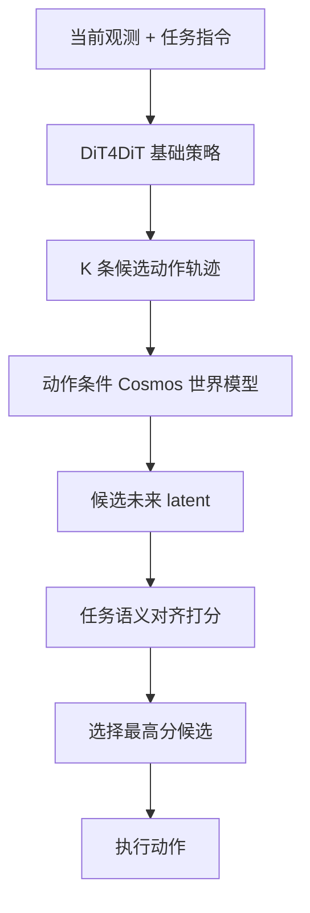

# DiT4DiT + FOREWARN：Stage 1

本仓库实现研究路线图的第一阶段：在 DiT4DiT 基础策略上生成多条动作候选，用动作条件世界模型预测各候选的未来结果，再根据任务语义与未来 latent 的一致性选择最佳动作。

当前版本只包含 Stage 1。RL selector 和 RL policy improvement 不在本阶段范围内。

## 方法概览



Stage 1 包含以下闭环：

1. Flow-matching action head 以不同初始噪声并行采样 `K` 条动作轨迹。
2. 每条动作轨迹经过可训练投影器，作为额外的 cross-attention token 输入 Cosmos-Predict2.5。
3. 世界模型先生成一条仅由观测和任务指令条件化的 reference rollout，再完成各候选动作的未来 rollout。
4. reference 与所有候选共享同一世界模型噪声；将候选未来 latent 与 reference future latent 做 cosine alignment。
5. 对每个 batch 执行 `argmax`，只返回被选中的动作，同时保留候选、分数和索引用于分析。

训练时使用数据集中的真实动作作为世界模型条件，并联合优化动作 flow-matching loss 与未来视频 flow-matching loss。推理时默认通过 `predict_action_stage1()` 执行完整候选规划。

## 仓库结构

```text
DiT4DiT/
├── DiT4DiT/
│   ├── config/
│   │   ├── libero/                  # LIBERO Stage 1 配置
│   │   ├── robocasa/                # RoboCasa-GR1 Stage 1 配置
│   │   └── deepseeds/               # Accelerate / DeepSpeed 配置
│   ├── dataloader/                  # LeRobot 数据加载
│   ├── model/
│   │   ├── framework/
│   │   │   ├── DiT4DiT.py           # 训练、基础推理及 Stage 1 主流程
│   │   │   └── stage1.py            # latent 打分和候选选择
│   │   └── modules/
│   │       ├── action_model/         # K 候选动作生成
│   │       └── vlm/Cosmos25.py       # 动作条件未来预测
│   └── training/                     # 训练入口
├── deployment/model_server/         # WebSocket 推理服务
├── examples/
│   ├── LIBERO/
│   └── Robocasa_tabletop/
├── docs/                             # benchmark 详细说明
└── tests/                            # Stage 1 单元测试
```

仓库已移除与本阶段无关的 Unitree G1 全身控制栈、第三方 SDK、机器人模型、二进制策略及演示媒体。

## 环境安装

### 要求

- Python 3.10+
- CUDA 12.4+
- 支持 bfloat16 的 NVIDIA GPU
- 训练建议使用多张大显存 GPU；Stage 1 会运行一条 reference 和 `K` 条候选 rollout，推理显存近似随 `K` 线性增长

安装 PyTorch 和项目依赖：

```bash
conda create -n dit4dit-stage1 python=3.10 -y
conda activate dit4dit-stage1

pip install torch==2.7.0 torchvision==0.22.0 torchaudio==2.7.0 \
  --index-url https://download.pytorch.org/whl/cu128
pip install -r requirements.txt
pip install -e .
```

下载 Cosmos-Predict2.5-2B：

```bash
huggingface-cli download nvidia/Cosmos-Predict2.5-2B \
  --revision diffusers/base/post-trained \
  --local-dir /path/to/Cosmos-Predict2.5-2B
```

## 配置 Stage 1

LIBERO 和 RoboCasa 配置已默认开启 Stage 1：

```yaml
framework:
  stage1:
    enabled: true
    num_candidates: 4
    valid_action_dim: 7  # LIBERO；RoboCasa 为 29
    world_model_seed: 42
    prompt_embedding_dim: null
```

参数含义：

| 参数 | 说明 |
| --- | --- |
| `framework.stage1.enabled` | 开启动作条件训练和 Stage 1 默认推理 |
| `framework.stage1.num_candidates` | 每次推理采样的候选数 `K` |
| `framework.stage1.valid_action_dim` | 去除 padding 后的真实动作维度；候选的其余维度在进入世界模型前清零 |
| `framework.stage1.world_model_seed` | 世界模型候选比较使用的共享噪声种子 |
| `framework.stage1.prompt_embedding_dim` | 动作 token 宽度；`null` 时从 Cosmos text encoder 自动推断 |
| `framework.cosmos25.future_num_inference_steps` | 每个候选的世界模型 rollout 步数 |
| `framework.cosmos25.future_loss_type` | 未来预测损失，默认 `flow_matching` |
| `trainer.loss_scale.future_video` | 联合训练时未来视频损失权重；未设置时为 `1.0` |

首次运行前至少修改配置或启动脚本中的：

- `framework.cosmos25.base_model`
- `datasets.vla_data.data_root_dir`
- `WANDB_API_KEY`、`wandb_entity`
- `accelerate launch --num_processes`

旧版 DiT4DiT checkpoint 没有动作条件投影器，只能运行基础策略。要验证 Stage 1，需要使用当前配置重新训练生成 checkpoint。

Stage 1 当前要求 `future_loss_type` 使用 latent flow-matching 系列；其他未来损失会在模型初始化时给出明确错误，以避免真实动作泄漏到基础策略特征。

### EndoWAM 离散动作头

EndoWAM 动作模式通过 `framework.action_model.action_head_type: discrete` 显式启用；未配置该字段时仍构建原有 flow-matching 动作头，因此已有 LIBERO、RoboCasa 配置和 checkpoint 不受影响。可将
[`DiT4DiT/config/endowam/action_model_discrete.yaml`](DiT4DiT/config/endowam/action_model_discrete.yaml)
和 [`DiT4DiT/config/endowam/discrete_dataset.yaml`](DiT4DiT/config/endowam/discrete_dataset.yaml)
合并到完整训练配置。核心字段为：

```yaml
framework:
  action_model:
    action_head_type: discrete
    action_dim: 3
    state_dim: 3
    future_action_window_size: 63
    action_horizon: 64
    num_action_classes: 3
    action_class_values: [-1, 0, 1]
    action_target_format: values
```

离散头为 64 个时间查询分别输出 3 个轴的三分类 logits，即 `[B, 64, 3, 3]`；训练 target 和 mask 均为 `[B, 64, 3]`。类别顺序随 checkpoint 保存，推理结果会解码回 `-1/0/+1`，不会把内部 class id 传给世界模型。

Stage 1 世界模型把解码后的 `[B,64,3]` 动作按每个“时间×轴”编码成三类 one-hot，再投影为 Cosmos 条件 token；它不会把 `-1/0/+1` 当连续坐标。连续动作配置仍保留原 projector 形状。

模型不会从连续 offset 猜测离散阈值。`action_target_format: values` 要求数据集已产出 `action_class_values` 中的值；若旧数据保存的是 class id，则必须按该 checkpoint 的真实 mapping 配置 `action_class_values` 并使用 `action_target_format: class_indices`。

离散数据加载器固定采样 `action_delta_indices=[0,...,63]`，校验动作恰为 `[64,3]`，并把 episode 末尾越界位置标成无效 mask。Google Drive 的 `endowam_pseudo_z60` 已注册为同名 mixture，包含 `ureter`、`ercp`、`esophagus` 三个 LeRobot v2.1 子集；同步后令 `datasets.vla_data.data_root_dir` 指向包含这三个目录的本地路径即可。

该数据集的实际映射为：`video.endoscope -> observation.images.endoscope`、`state.endoscope_state -> observation.state`、`action.endoscope_cmd -> action`、`annotation.human.action.task_description -> task_index`。Drive 元数据及 parquet 抽样均确认 state/action 为 3 维，合法值为 `{-1,0,1}`；加载器只做 tensor 转换，不对这些标签归一化或二次离散化。完整数据项配置见 [`DiT4DiT/config/endowam/discrete_dataset.yaml`](DiT4DiT/config/endowam/discrete_dataset.yaml)。

## 数据准备

### LIBERO

下载 LeRobot 格式的 LIBERO Spatial、Object、Goal 和 LIBERO-10 数据，并将其共同放在配置的 `data_root_dir` 下。原 benchmark 的环境与数据说明见 [docs/libero.md](docs/libero.md)。

### RoboCasa-GR1

```bash
python examples/Robocasa_tabletop/train_files/download_gr00t_ft_data.py
```

随后将 `DiT4DiT/config/robocasa/dit4dit_robocasa_gr1.yaml` 中的数据路径改为实际下载位置。原 benchmark 的环境与数据说明见 [docs/robocasa_tabletop.md](docs/robocasa_tabletop.md)。

数据样本必须提供：

- `image`：当前帧及未来监督帧；
- `lang`：任务指令；
- `action` 和 `action_mask`：动作轨迹及有效维度；
- `state`：配置启用 state conditioning 时的机器人状态。

## 训练

LIBERO：

```bash
bash examples/LIBERO/train_files/run_libero.sh
```

RoboCasa-GR1：

```bash
bash examples/Robocasa_tabletop/train_files/run_robocasa.sh
```

两个脚本都调用：

```bash
accelerate launch \
  --config_file DiT4DiT/config/deepseeds/deepspeed_zero2.yaml \
  DiT4DiT/training/train.py \
  --config_yaml /path/to/stage1-config.yaml
```

训练模式建议保持为：

```yaml
framework:
  cosmos25:
    training: joint
```

`joint` 模式同时计算 `action_loss` 和 `future_video_loss`。训练日志应能看到：

- `action_dit_loss`
- `future_video_loss`
- `future_video_loss_scaled`
- `total_loss`

可加载的 checkpoint 需要与运行配置、归一化统计保持以下目录关系：

```text
<run_dir>/
├── config.yaml
├── dataset_statistics.json
├── checkpoints/
│   └── steps_40000_pytorch_model.pt
└── final_model/
    └── pytorch_model.pt
```

因此不要单独移动 `.pt` 文件。`from_pretrained()` 会从 checkpoint 的上两级目录读取 `config.yaml` 和 `dataset_statistics.json`。训练入口会在启动时保存完整配置，并在构建数据集时保存统计文件，因此周期性 checkpoint 和 `final_model/pytorch_model.pt` 均可沿用同一 `<run_dir>` 下的配套文件。

## Stage 1 推理

### Python 接口

```python
import numpy as np
import torch
from PIL import Image

from DiT4DiT.model.framework.base_framework import baseframework

checkpoint = "/path/to/run/checkpoints/steps_40000_pytorch_model.pt"
model = baseframework.from_pretrained(checkpoint)
model = model.to(device="cuda", dtype=torch.bfloat16).eval()

# LIBERO 示例；必须使用与各 benchmark 训练时完全相同的 state transform。
state = np.asarray(raw_state, dtype=np.float32).reshape(1, -1)
state = np.stack([np.sin(state), np.cos(state)], axis=-1).reshape(1, -1)
assert state.shape[-1] <= 16
state_array = np.pad(state, ((0, 0), (0, 16 - state.shape[-1])))

result = model.predict_action(
    examples=[
        {
            "image": [Image.open("observation.png").convert("RGB")],
            "lang": "put the red mug into the drawer",
            "state": state_array,
        }
    ],
    num_candidates=4,
)

action = result["normalized_actions"]       # (B, T, D)，已选中的动作
scores = result["candidate_scores"]         # (B, K)
indices = result["selected_indices"]        # (B,)
candidates = result["candidate_actions"]    # (B, K, T, D)
```

当 checkpoint 的 `framework.stage1.enabled=true` 时，`predict_action()` 默认路由到 Stage 1。调试基础策略可显式传入 `disable_stage1=True`。

也可以直接调用：

```python
result = model.predict_action_stage1(examples, num_candidates=4)
```

### 推理服务

```bash
CUDA_VISIBLE_DEVICES=0 python deployment/model_server/server_policy.py \
  --ckpt_path /path/to/run/checkpoints/steps_40000_pytorch_model.pt \
  --port 6398 \
  --use_bf16
```

客户端继续读取 `normalized_actions` 即可；响应中还包含 `candidate_actions`、`candidate_scores` 和 `selected_indices`。

## Benchmark 评估

LIBERO：

```bash
bash examples/LIBERO/eval_files/batch_eval_libero.sh \
  /path/to/run/checkpoints/steps_40000_pytorch_model.pt 0
```

RoboCasa-GR1：

```bash
bash examples/Robocasa_tabletop/eval_files/batch_eval_args.sh \
  /path/to/run/checkpoints/steps_50000_pytorch_model.pt 1 720 12 "0,1,2,3"
```

运行前需要按脚本注释配置模型环境与模拟器环境的 Python 路径。

建议至少报告以下 Stage 1 对照实验：

- `K=1`：没有候选间比较，但仍运行一次动作条件世界模型；
- `K=2/4/8`：候选规模与成功率、延迟、显存的关系；
- 基础策略：`disable_stage1=True`；
- 随机候选选择（建议消融，当前没有内置开关）；
- latent alignment 选择。

现有 benchmark CLI 不直接暴露 `num_candidates` 与 `disable_stage1`。修改 `K` 时可编辑 checkpoint 所属 `<run_dir>/config.yaml`，或在客户端请求的 `vla_input` 中加入对应字段；基础策略对照使用 `disable_stage1: true`。

## 测试

```bash
pytest -q tests/test_stage1.py
```

测试覆盖 batch/candidate 排列、latent alignment、`argmax` 选择和输入 shape 校验。完整 Cosmos 前向仍需要模型权重与 CUDA 环境。

## 当前边界

- 当前 selector 是零样本 latent alignment，不包含 RL。
- 世界模型只从离线数据中的真实动作学习，候选动作分布外泛化能力取决于数据覆盖范围。
- `K` 个候选目前作为一个展平 batch 运行；显存不足时应降低 `num_candidates`。
- Stage 1 的目标是验证 FOREWARN 式候选预测与选择能否迁移到 DiT4DiT，而不是优化基础策略本身。

## Citation

本项目基于 DiT4DiT。使用相关代码时请引用原工作：

```bibtex
@article{ma2026dit4dit,
  title={DiT4DiT: Jointly Modeling Video Dynamics and Actions for Generalizable Robot Control},
  author={Ma, Teli and Zheng, Jia and Wang, Zifan and Jiang, Chunli and Cui, Andy and Liang, Junwei and Yang, Shuo},
  journal={arXiv preprint arXiv:2603.10448},
  year={2026}
}
```

## License

本项目使用 [MIT License](LICENSE)。DiT4DiT 原始实现与 Cosmos-Predict2.5 等依赖分别遵循各自许可证。
